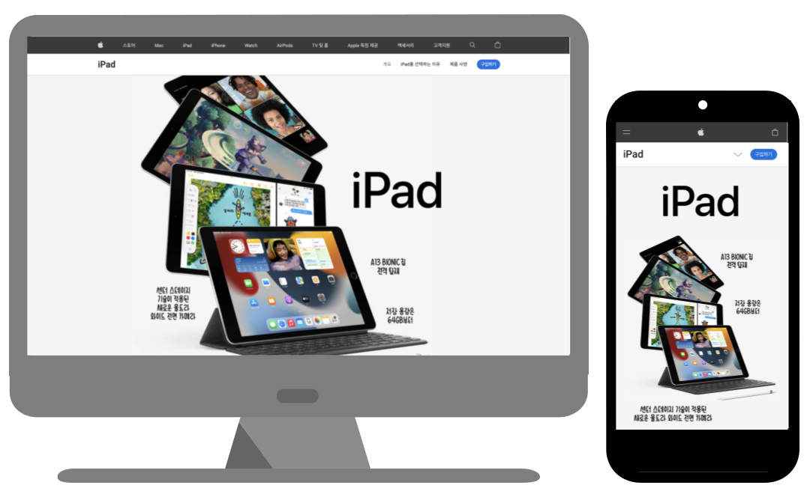

# Apple iPad

* Apple iPad 제품 페이지를 반응형으로 구현
* Demo : [Apple iPad 제품 페이지(Clone)](https://apple-ipad-lani.netlify.app)

## 기능
* 데스크탑, 태블릿, 모바일 버전에서 확인할 수 있는 반응형 웹
* header의 검색버튼을 누르면 검색 창 표시
* header의 장바구니를 누르면 장바구니 드롭다운 메뉴 표시
* 반투명 navbar 사용
* Sprite Image 애니메이션을 적용한 아이콘 사용
* 요소의 가시성을 관찰하여 애니메이션 적용
* 모바일 버전에서 아코디언 메뉴로 footer의 내비게이션 표현

## 사용 기술 및 라이브러리

### 기술

* HTML
* CSS
* JavaScript

### 테스트
* Cypress

### 라이브러리

* [Reset.css](https://www.jsdelivr.com/package/npm/reset-css) (v5.0.2)
* [Google Fonts - 영어: Roboto, 한글: Noto Sans Korean](https://fonts.google.com/)

### 새로 설치한 익스텐션
* Comment tagged templates (v0.3.2)
  - JavaScript에서 언어 식별자 주석을 사용하여 소스코드를 꾸며주는 익스텐션

## 개선사항
* 에러 페이지 개선 필요